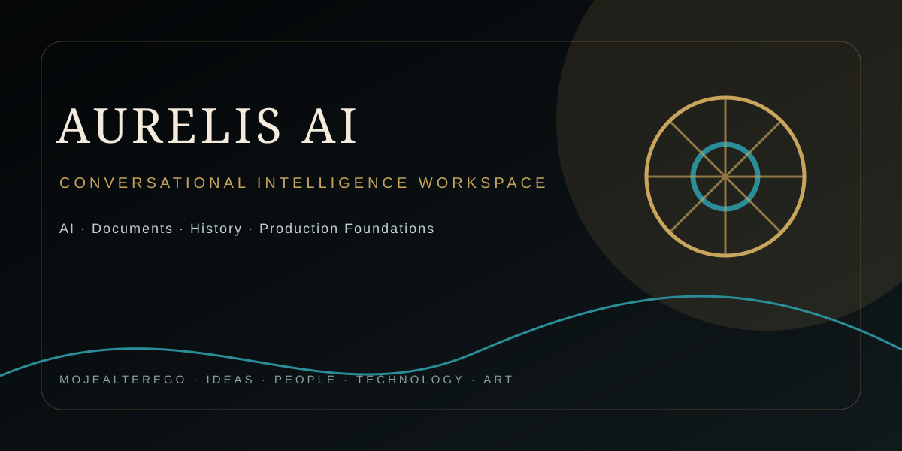

<div align="center">



</div>

---

# AURELIS AI

> **Intelligence, refined.**

AURELIS AI is a premium conversational intelligence workspace for thinking, creating, researching and working with AI.

The product combines streaming AI conversations, persistent history, authentication, file workflows, documents and interactive artifacts in one focused interface. Its visual language is deliberately restrained: obsidian, 24-karat gold, snow white, burgundy, royal blue and bottle green, supported by an editorial display typeface and a high-contrast functional UI.

## Product identity

| Element | AURELIS standard |
| --- | --- |
| Brand | **AURELIS** |
| Product | **AURELIS AI** |
| Tagline | **Intelligence, refined.** |
| Supporting line | **Inteligencja. Precyzja. Forma.** |
| Primary language | Polish, with adaptive multilingual responses |
| Visual system | Obsidian · 24K Gold · Snow White · Burgundy · Royal Blue · Bottle Green |
| Display typography | Cormorant Garamond |
| Interface typography | Geist |

The supplied AM / Andrzej Mikulski crest has been translated into a reusable vector brand lockup used across the product shell, authentication experience and application icon.

## Core capabilities

- **Conversational AI** — streaming responses, model selection and tool-enabled workflows.
- **Artifacts and documents** — writing, editing, coding and spreadsheet-oriented work alongside the conversation.
- **Persistent history** — authenticated conversation storage and management.
- **Files** — upload and multimodal attachment workflows.
- **Authentication** — registration, login and guest-capable application flows.
- **Responsive UI** — desktop and mobile layouts with light and dark themes.
- **Observability** — OpenTelemetry instrumentation and controlled application errors.
- **Production foundations** — PostgreSQL, Drizzle ORM, Next.js App Router, AI SDK and Playwright coverage.

## Architecture

The application is built around:

- **Next.js 16 + App Router**
- **React 19**
- **AI SDK 6** and Vercel AI Gateway
- **Tailwind CSS 4 + Radix UI / shadcn-style primitives**
- **Drizzle ORM + PostgreSQL**
- **Auth.js / NextAuth**
- **Vercel Blob** for file storage
- **Playwright** for end-to-end tests
- **OpenTelemetry / Vercel OTEL** for observability

The repository retains compatible internal technical identifiers where changing them would create unnecessary migration risk. Public product-facing language is AURELIS.

## Local development

```bash
pnpm install
pnpm db:migrate
pnpm dev
```

Open `http://localhost:3000`.

Configure environment variables from `.env.example`. Never commit credentials, provider keys, session secrets or database credentials.

## Quality gates

```bash
pnpm lint
pnpm test
pnpm build
```

A production deployment should pass linting, database migration checks, the end-to-end suite and a production build in an environment representative of the target runtime.

## Security baseline

- Keep secrets exclusively in environment variables or the hosting provider's secret store.
- Restrict database and object-storage access to the services that require it.
- Treat uploaded files and model/tool inputs as untrusted data.
- Preserve authentication and authorization checks on every data-changing route.
- Avoid exposing session material, provider credentials, internal prompts or infrastructure details to clients.
- Monitor application errors and latency in production.

## Design principles

### 01 — Restraint
Gold is an accent, not a wallpaper. The interface should feel expensive through spacing, typography, hierarchy and material contrast rather than visual noise.

### 02 — Signal over ceremony
AURELIS should get out of the user's way. Clear tasks, direct responses, deliberate motion and minimal chrome take precedence over decorative interaction.

### 03 — Human control
The assistant can accelerate work, but the user remains the decision-maker. Actions, destructive operations and tool approvals should be explicit and legible.

### 04 — Technical honesty
The interface and assistant must never imply that an operation happened when it did not. Errors should be actionable; uncertainty should be visible when it affects a decision.

## Status

AURELIS AI is an actively evolving product foundation. The current repository focuses on turning a capable AI-chat architecture into a coherent, premium and Polish-first product experience without sacrificing its underlying technical capabilities.

## License

See [`LICENSE`](LICENSE).
